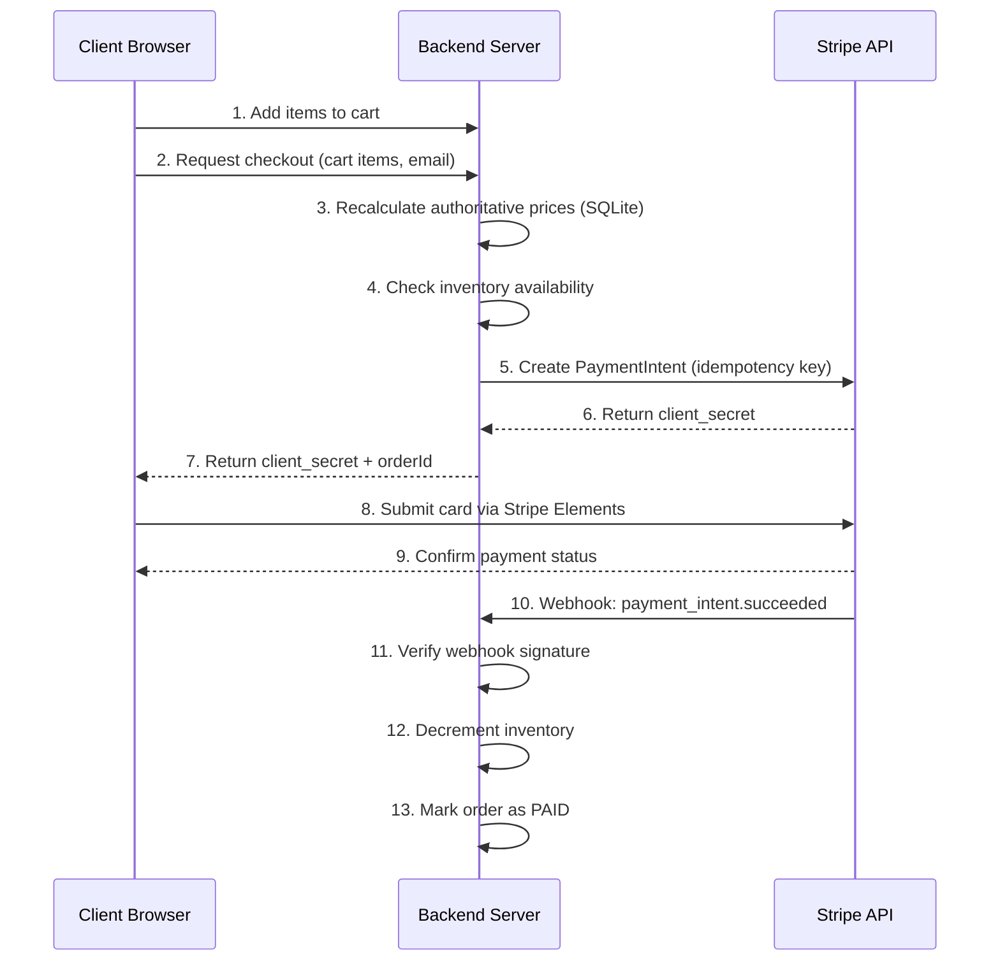

# 🛒 E-Commerce Checkout Flow & Stripe Payment Engine

A production-grade, full-stack checkout integration built with **Node.js, Express, SQLite, and the Stripe Payments API**. It implements server-side price authority, PCI-scoped card collection via Stripe Elements, idempotent PaymentIntent creation, and signature-verified webhook processing for reliable order fulfillment.

---

## 📋 Table of Contents

- [Key Features](#-key-features)
- [Tech Stack](#️-tech-stack)
- [Folder Structure](#-folder-structure)
- [Prerequisites](#-prerequisites)
- [System Architecture & Workflow](#-system-architecture--workflow)
- [Database Schema](#-database-schema)
- [API Endpoints Specification](#-api-endpoints-specification)
- [Environment Variables](#️-environment-variables)
- [Quickstart Guide](#-quickstart-guide)
- [Testing Webhooks Locally](#-testing-webhooks-locally)
- [Security Best Practices](#-security-best-practices-implemented)
- [Error Handling & Edge Cases](#-error-handling--edge-cases)
- [Known Limitations / Roadmap](#-known-limitations--roadmap)
- [License](#-license)

---

## 🚀 Key Features

- **Authoritative Server-Side Pricing** — client-submitted prices are never trusted; totals are recalculated from SQLite on every request.
- **Stripe Elements Integration** — PCI-scope-reduced, PCI-compliant-by-design card inputs; raw card data never touches the backend.
- **Idempotent Payment Intent Creation** — duplicate checkout requests (double-clicks, client retries) are deduplicated via Stripe idempotency keys, preventing double charges.
- **Asynchronous Webhook Processing** — signature-verified listener for `payment_intent.succeeded`, `payment_intent.payment_failed`, and `charge.refunded` events, decoupled from the checkout request/response cycle.
- **SQLite Transaction Persistence** — normalized tables for products, orders, and order line items, with order status as the single source of truth.
- **Inventory Awareness** — stock levels checked at intent creation and decremented only on confirmed payment, to reduce (not eliminate) overselling risk.
- **Order Lookup & Refunds** — endpoints to check order/payment status and issue refunds without touching the Stripe dashboard.
- **Rate Limiting** — checkout and payment endpoints are throttled to blunt card-testing / carding attacks, a common abuse pattern against public Stripe integrations.
- **Structured Error Handling** — consistent error shape across validation failures, Stripe API errors, and webhook failures.

---

## 🛠️ Tech Stack

| Layer | Technology |
|---|---|
| Frontend | HTML5, Tailwind CSS, JavaScript (ES6+), Stripe Elements JS SDK |
| Backend | Node.js, Express.js |
| Database | SQLite (`better-sqlite3`) |
| Payments | Stripe Node.js SDK (`stripe`) |
| Validation | `zod` or `express-validator` (recommended, not yet wired in) |
| Rate Limiting | `express-rate-limit` |
| Env Management | `dotenv` |

---

## 📁 Folder Structure

```
ecommerce-checkout-stripe/
├── public/                  # Static frontend assets
│   ├── index.html
│   ├── checkout.html
│   └── js/
│       ├── cart.js
│       └── checkout.js
├── src/
│   ├── db/
│   │   ├── schema.sql
│   │   └── connection.js
│   ├── routes/
│   │   ├── products.js
│   │   ├── checkout.js
│   │   ├── orders.js
│   │   └── webhooks.js
│   ├── services/
│   │   ├── pricing.js       # Server-side price recalculation
│   │   ├── inventory.js     # Stock checks & decrements
│   │   └── stripeClient.js
│   ├── middleware/
│   │   ├── rateLimiter.js
│   │   └── errorHandler.js
│   └── app.js
├── scripts/
│   └── seed.js               # Seeds product catalog
├── .env.example
├── package.json
└── README.md
```

---

## ✅ Prerequisites

- **Node.js** ≥ 18.x
- **npm** ≥ 9.x
- A [Stripe account](https://dashboard.stripe.com/register) (test mode is fine)
- [Stripe CLI](https://stripe.com/docs/stripe-cli) for local webhook testing

---

## 📐 System Architecture & Workflow



---

## 📊 Database Schema

```sql
-- Products Catalog
CREATE TABLE IF NOT EXISTS products (
    id            TEXT PRIMARY KEY,
    name          TEXT NOT NULL,
    description   TEXT,
    price_cents   INTEGER NOT NULL,   -- smallest currency unit, e.g. $10.00 = 1000
    stock_qty     INTEGER NOT NULL DEFAULT 0,
    image_url     TEXT
);

-- Customer Orders
CREATE TABLE IF NOT EXISTS orders (
    id                          TEXT PRIMARY KEY,
    stripe_payment_intent_id   TEXT UNIQUE NOT NULL,
    amount_total_cents         INTEGER NOT NULL,
    status                     TEXT NOT NULL DEFAULT 'PENDING', -- PENDING, PAID, FAILED, REFUNDED
    customer_email             TEXT NOT NULL,
    idempotency_key            TEXT UNIQUE,
    created_at                 DATETIME DEFAULT CURRENT_TIMESTAMP,
    updated_at                 DATETIME DEFAULT CURRENT_TIMESTAMP
);

-- Order Line Items
CREATE TABLE IF NOT EXISTS order_items (
    id                INTEGER PRIMARY KEY AUTOINCREMENT,
    order_id          TEXT NOT NULL,
    product_id        TEXT NOT NULL,
    quantity          INTEGER NOT NULL,
    unit_price_cents  INTEGER NOT NULL,
    FOREIGN KEY (order_id) REFERENCES orders(id),
    FOREIGN KEY (product_id) REFERENCES products(id)
);
```

---

## 🔌 API Endpoints Specification

| Method | Endpoint | Description | Request Body | Response |
|---|---|---|---|---|
| `GET` | `/api/products` | Retrieve product catalog | — | `[{ id, name, price_cents, stock_qty, ... }]` |
| `POST` | `/api/checkout` | Recalculate total, check stock, create PaymentIntent | `{ items: [{ id, quantity }], email }` | `{ clientSecret, orderId, totalAmountCents }` |
| `GET` | `/api/orders/:id` | Look up order/payment status | — | `{ id, status, amountTotalCents, createdAt }` |
| `POST` | `/api/orders/:id/refund` | Issue a full or partial refund | `{ amountCents? }` | `{ refundId, status }` |
| `POST` | `/api/webhooks` | Handle async Stripe events (raw body) | Raw binary payload | `{ received: true }` |

**Standard error response shape:**
```json
{
  "error": {
    "code": "INSUFFICIENT_STOCK",
    "message": "Only 2 units of 'product_id' remain.",
    "details": {}
  }
}
```

---

## ⚙️ Environment Variables

Create a `.env` file in the project root (see `.env.example`):

```env
# Server
PORT=3000
NODE_ENV=development

# Stripe API Keys — https://dashboard.stripe.com/apikeys
STRIPE_PUBLISHABLE_KEY=pk_test_51...
STRIPE_SECRET_KEY=sk_test_51...

# Stripe Webhook Secret — from Stripe CLI or Dashboard webhook config
STRIPE_WEBHOOK_SECRET=whsec_...

# Rate Limiting
CHECKOUT_RATE_LIMIT_WINDOW_MS=60000
CHECKOUT_RATE_LIMIT_MAX=10
```

---

## 🏁 Quickstart Guide

### 1. Clone the repository
```bash
git clone https://github.com/your-username/ecommerce-checkout-stripe.git
cd ecommerce-checkout-stripe
```

### 2. Install dependencies
```bash
npm install express stripe dotenv better-sqlite3 cors express-rate-limit
npm install --save-dev nodemon
```

### 3. Configure environment
```bash
cp .env.example .env
# then fill in your Stripe keys
```

### 4. Initialize & seed the database
```bash
node scripts/seed.js
```

### 5. Run the development server
```bash
npm run dev
```

---

## 🧪 Testing Webhooks Locally

1. **Authenticate the Stripe CLI:**
   ```bash
   stripe login
   ```

2. **Forward events to your local server:**
   ```bash
   stripe listen --forward-to localhost:3000/api/webhooks
   ```

3. **Copy the signing secret** printed by the CLI into `.env` as `STRIPE_WEBHOOK_SECRET`.

4. **Test cards (Stripe sandbox):**

| Card Number | Expiry | CVC | Scenario |
|---|---|---|---|
| `4242 4242 4242 4242` | Any future date | Any 3 digits | Successful payment |
| `4000 0000 0000 0002` | Any future date | Any 3 digits | Card declined |
| `4000 0000 0000 0085` | Any future date | Any 3 digits | Insufficient funds |
| `4000 0000 0000 9995` | Any future date | Any 3 digits | Insufficient funds (alt code) |
| `4000 0025 0000 3155` | Any future date | Any 3 digits | Requires 3D Secure authentication |

---

## 🔒 Security Best Practices Implemented

- **PCI Scope Reduction** — raw card data is captured and tokenized entirely client-side by Stripe Elements; it never transits or is stored on this server.
- **Webhook Signature Verification** — every incoming webhook is validated against its cryptographic signature before being acted on, preventing forged "payment succeeded" calls.
- **Raw Body Parsing on Webhook Route** — the webhook endpoint reads the raw request body (not JSON-parsed) so Stripe's signature check succeeds.
- **Idempotent Payment Creation** — idempotency keys prevent duplicate PaymentIntents from retried or double-submitted checkout requests.
- **Server-Side Price Authority** — client-submitted prices are discarded; totals are always recomputed from the database.
- **Rate Limiting** — checkout and payment endpoints are throttled per IP/session to reduce card-testing abuse.

---

## 🧯 Error Handling & Edge Cases

Explicitly handled (or flagged for the agent to implement):

- Cart contains a product ID that no longer exists → `404 PRODUCT_NOT_FOUND`
- Requested quantity exceeds available stock → `409 INSUFFICIENT_STOCK`
- Invalid or missing email format → `400 VALIDATION_ERROR`
- Stripe API error (network, auth, rate limit) during intent creation → `502 STRIPE_ERROR`, order left in `PENDING`
- Webhook received with invalid signature → `400`, event discarded and logged
- Webhook received for an unknown `payment_intent_id` → logged as an anomaly, not silently dropped
- Duplicate webhook delivery (Stripe retries) → handled idempotently via order status check before mutating state

---

## 🗺️ Known Limitations / Roadmap

**Not yet implemented — flag these explicitly if building this out:**

- No tax or shipping cost calculation (stubbed at $0)
- No discount/coupon code support
- Single currency only (USD assumed)
- No guest vs. returning-customer distinction (no Stripe Customer object reuse)
- No automated email receipts (can be delegated to Stripe's built-in receipts or a separate email service)
- No admin dashboard for order/inventory management
- Inventory decrement is not fully atomic under high concurrency — acceptable for low-volume use, needs a proper reservation system (or Stripe's inventory tools) at scale

---

## 📜 License

Distributed under the MIT License. See `LICENSE` for details.